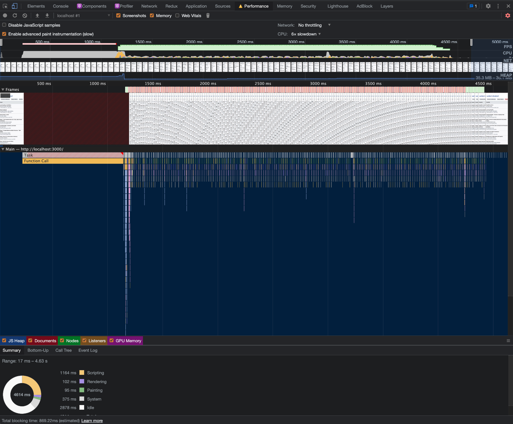

# Menu with Anchor

## User Story

- Activate and scroll corresponding category chip when scrolling the menu up and down.

  

- Reach the bottom

  If clicked a category chip -> always activate the clicked category chip

  If not -> Always activate the last category chip

  

## Performance

- Optimize performance to 60 FPS

  Performance Record under 6x slowdown CPU (with 8 categories and each category has 10 items)

  

## Tech Stack

- React
- TypeScript
- tailwindcss
- Intersection Observer API -> To observe whether categories and footer are in view or not.
- requestAnimationFrame -> To smoothly scroll vertically and horizontally.
- RxJS -> To wrap intersection observer entries into an observable for handling complicated asynchronous behavior.
